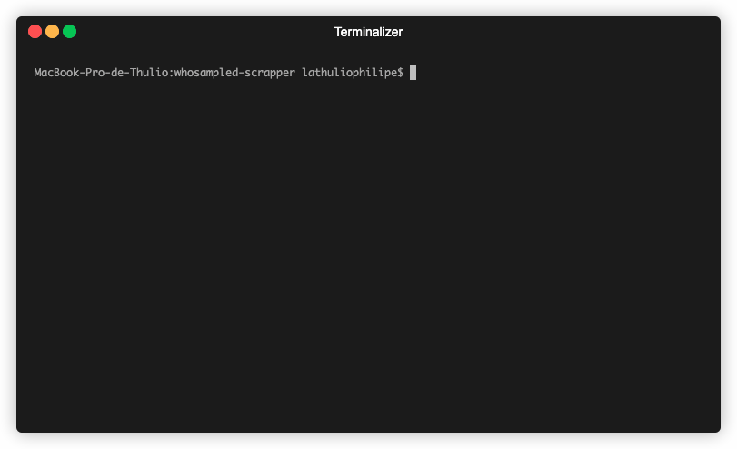

# Who Sampled Scraper

API that gets samples information from [WhoSampled](https://www.whosampled.com) website.

> [API Demo](https://whosampled-scraper.herokuapp.com) or [Postman Collection](https://documenter.getpostman.com/view/9591924/SzYUah8C)



## Requirements

In order to run this project locally, you must have:

- [Nodejs@12.14.0](https://nodejs.org/dist/v12.14.0/)
- [Nestjs CLI](https://nestjs.com/)

## Usage

To install all dependencies, run:

```bash
$ npm install
```

### development

To start the **development** mode, run:

```bash
$ npm run start:dev
```

### production

To generate a **production** version, run:

```bash
$ npm run build
```

To **serve a production** version, run:

```bash
$ npm run start:prod
```

## License

[MIT License](https://thulioph.mit-license.org/) © Thulio Philipe