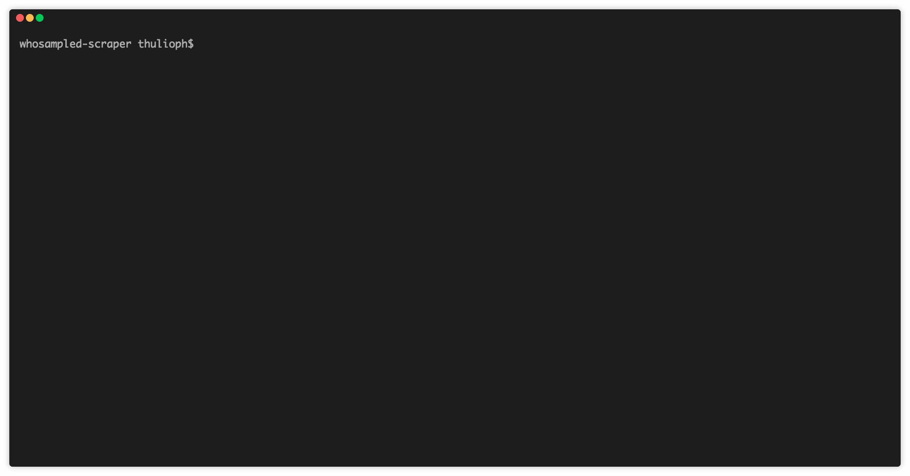

# WhoSampled Scraper

A scraper that gets samples information from [whosampled](https://www.whosampled.com).



## Installation

Use the package manager [npm](https://www.npmjs.com/get-npm) to install all dependencies.

```bash
$ npm install
```

## Usage

```bash
$ npm start
```

## Contributing

Pull requests are welcome. For major changes, please open an issue first to discuss what you would like to change.

Please make sure to update tests as appropriate.

## License

[MIT](https://thulioph.mit-license.org/)